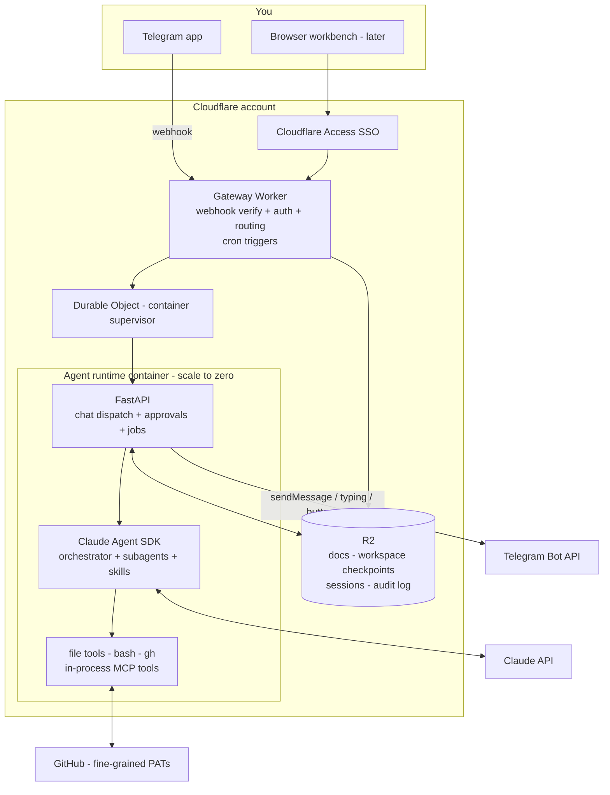

# FlowState — Personal AI Assistant: Final Plan

*Finalised 2026-07-20 after design discussion. This is the working plan; update it as decisions change.*

FlowState is a private, multi-agent personal assistant built on the **Claude Agent SDK** (Python) with **FastAPI**, deployed **serverless on Cloudflare**, and used day-to-day through **Telegram**. It answers questions about personal documents (bills, bank statements), personal GitHub repositories, and the personal website — and takes gated actions (PRs, deploys) only with explicit approval.

---

## 1. Principles

1. **Core loop first.** A working, deployed, usable single agent before any specialisation. Every phase ends with something used daily.
2. **Own the data.** Documents, transcripts, memory live in our Cloudflare account (R2), not scattered across services.
3. **Trust boundaries over convenience.** The agent reads untrusted content while holding write credentials — so specialists get minimal tools, and irreversible actions require human approval.
4. **Serverless economics.** Idle cost ≈ $5/month. Compute bills only while a conversation is active; Claude tokens only when it thinks.
5. **Boring, replaceable parts.** FastAPI + a container + object storage. The container runs unchanged on Cloud Run/Fly if Cloudflare ever stops fitting.
6. **Inspired, not copied.** Patterns and gotchas were harvested from a production Agent-SDK-on-Cloudflare system we studied; every line of FlowState is written from scratch and sized for one user.

## 2. Decision log

| Decision | Choice | Why |
|---|---|---|
| Runtime platform | **Cloudflare Containers** (not Workers) | The SDK spawns the bundled Claude Code harness as a Node subprocess with filesystem access; V8/Pyodide isolates can't do that. Containers scale to zero and are a validated pattern for this SDK. |
| Agent framework | **Claude Agent SDK, self-hosted** (not Anthropic Managed Agents) | We want to build and own it; best local dev loop; data stays in our storage. CMA remains a future option for headless scheduled jobs. |
| Primary interface | **Telegram bot** (web UI later as a workbench) | Phone-native, async (fits minutes-long turns and scale-to-zero), push notifications for proactive digests, inline buttons for approvals, native file upload for bills. |
| WhatsApp | **Dropped** | Business API friction (separate number, 24-hour session window + approved templates for proactive messages, per-message pricing, AI-assistant policy risk); unofficial libraries risk account bans and need an always-on connection that fights our serverless design. Can be revisited later — the channel adapter keeps that door open. |
| Structured data | **SQLite file in the workspace** (not D1/Postgres) | Single writer, single user. Checkpointed to R2. |
| Workspace persistence | **Explicit R2 sync at turn boundaries** (not R2 FUSE mount) | Fewer sharp edges (FUSE mounts have idempotency/permission quirks and no inotify); FUSE stays in the back pocket. |
| Long-term memory | **Markdown wiki in the workspace, git-versioned** | See §5. Native fit for the SDK's file tools; human-readable and hand-editable; no vector DB at personal scale. |
| Auth to the app | **Cloudflare Access** (SSO) for web/API; hardened public webhook for Telegram only | Single user; nothing else is internet-reachable. |
| Infrastructure as code | **Two layers: wrangler config (app) + Terraform (platform)** | Containers and DO migrations are only first-class in wrangler — `wrangler.jsonc` *is* the app-layer IaC. Access policies, DNS, and R2 bucket lifecycle are only expressible in Terraform, so a small `infra/` covers those. Pulumi/Alchemy considered; Terraform chosen as the boring default. |

## 3. Architecture



**Gateway Worker** (`gateway/`, TypeScript + Hono)
- `/webhook/telegram` — the one public endpoint: verifies Telegram's webhook secret-token header, hard-allowlists our chat ID, drops everything else, acks fast, forwards the normalized update to the container.
- Everything else behind Cloudflare Access. Streams SSE for the (later) web workbench; handles large-file uploads straight to R2; owns cron triggers.

**Agent runtime** (`runtime/`, Python 3.12 container, non-root user)
- FastAPI: `POST /chat` (channel-agnostic turn dispatch), `POST/GET /approvals`, `GET /healthz`, `POST /jobs/{name}` (cron entrypoints).
- Claude Agent SDK (Node bundled with the SDK — nothing extra to install) + `gh` + `sqlite3` + git.
- Channel adapters: a thin interface so Telegram, the debug page, and future channels share the same conversation/approval plumbing. Telegram adapter: immediate ack → async turn → `sendChatAction` typing loop → reply via `sendMessage` (chunked to the 4096-char limit; progressive message-edit for long turns).
- Workspace `/data`, restored from R2 on cold start, checkpointed after every turn.
- Instance: `basic` (1 GiB) to start; `standard` if repo work needs it. `sleepAfter` ≈ 30 min.

**Secrets** (`wrangler secret`): `ANTHROPIC_API_KEY`, `TELEGRAM_BOT_TOKEN`, `TELEGRAM_WEBHOOK_SECRET`, `GITHUB_TOKEN_RO`, `GITHUB_TOKEN_RW`, `GATEWAY_SHARED_SECRET`. The container is never directly internet-reachable.

**Infrastructure as code** — two layers:
- *App layer* (`gateway/wrangler.jsonc`, applied by CI on every deploy): Worker, Durable Object + migrations, container image + instance type, R2 bindings, cron triggers, routes.
- *Platform layer* (`infra/`, Terraform, applied manually — changes are rare): R2 bucket creation (`prevent_destroy` — it holds statements and the wiki) with versioning/lifecycle, Cloudflare Access application + policies, DNS/custom domain, Email Routing (Phase 7), API tokens. Remote state (R2 S3-compatible backend or Terraform Cloud free tier) — never committed to git. **Runtime secrets never go through Terraform** (state stores values in plaintext); they stay on the `wrangler secret` path. Bootstrap order: `terraform apply` first, then `wrangler deploy` referencing the created resources.

## 4. Multi-agent design

The SDK provides the multi-agent machinery — orchestrator + subagents (`agents` option) + skills. We do not build a routing layer.

**Orchestrator** — persona, routing policy, workspace map, wiki conventions in `runtime/.claude/CLAUDE.md`. Default model Sonnet; per-request Opus escalation (e.g. `/model opus` Telegram command).

| Subagent | Purpose | Tools (deliberately minimal) |
|---|---|---|
| `finance` | Parse statements/bills → SQLite; cited spend answers | Read/Grep/Glob + `finance_sql` MCP tool. **No bash, no network, no writes outside `/data/finance`** |
| `repo` | Q&A + gated actions on personal repos | Read/Grep/Glob, Bash (`git`, `gh`), Write/Edit inside `/data/repos` |
| `website` | Content edits + deploy of the personal site | As `repo`, scoped to the website repo + `deploy-site` skill |
| `research` | Web questions | WebSearch, WebFetch |

**Skills** (`runtime/.claude/skills/`): `ingest-statement`, `spend-report`, `repo-actions` (branch/commit/PR house rules; never push main), `deploy-site`, `weekly-digest`. **No-overlap rule:** every instruction lives in exactly one place — CLAUDE.md for always-relevant, a skill for situational.

**Custom tools** — in-process MCP (`@tool` functions in the FastAPI process): `finance_sql` (read-only SQL + guarded ingestion upsert), `list_docs`/`fetch_doc` (R2 browse), `notify` (Telegram push).

**Approvals (human-in-the-loop)** — the SDK's `can_use_tool` callback holds risky calls (push, `gh pr create`, deploys, writes outside the workspace): an approval record is created, a Telegram message with **[Approve] [Deny]** inline buttons is sent, the callback resolves when you tap (default-deny on timeout, ~10 min). Read-only tools are allowlisted for zero friction. Every decision lands in the audit log.

## 5. Memory: the wiki

Three tiers:

| Tier | What | Where | Loaded |
|---|---|---|---|
| Always-on | Persona, rules, wiki map | `CLAUDE.md` | Every session (small, cache-friendly) |
| **Wiki — permanent memory** | Facts, conventions, learned knowledge | `/data/wiki/**/*.md` | On demand (grep/read) |
| Conversational | Session transcripts | SDK session store → R2 | On resume |

```
/data/wiki/
├── INDEX.md              ← one line per page; the agent's map
├── me/profile.md         ← preferences, timezone, accounts overview
├── finance/accounts.md · merchants.md · subscriptions.md
├── projects/<repo>.md    ← per-repo conventions, decisions
└── howto/…               ← learned procedures
```

Conventions (enforced via CLAUDE.md): consult the wiki before answering personal questions; update-in-place, never duplicate; small single-topic pages; keep INDEX.md current; **record facts, never instructions** (wiki content re-enters future contexts and some derives from untrusted documents). `git init` inside the wiki — the agent commits after each edit (history, diffs, rollback). Optional later: push to a private `flowstate-memory` GitHub repo. A Phase 8 cron **gardener** dedupes/prunes/flags contradictions. SDK auto-memory disabled (`CLAUDE_CODE_DISABLE_AUTO_MEMORY=1`) — one memory system, not two.

## 6. Data & persistence

```
/data
├── docs/                  ← originals (mirror of R2 docs/), incl. Telegram-uploaded bills
├── finance/finance.db     ← SQLite: transactions, categories, accounts
├── wiki/                  ← §5 (git repo)
├── repos/                 ← clone cache — disposable, never checkpointed
└── audit/audit.jsonl      ← append-only tool-call log, shipped to R2
```

- **Cold start:** restore workspace + SDK session store from R2 (seconds).
- **After every turn:** checkpoint changed small state (finance.db, wiki, sessions, audit) to R2. A recycled container loses nothing that completed.
- **Session continuity:** copy the SDK's session JSONL (`~/.claude/projects/<encoded-cwd>/<id>.jsonl`) to durable storage at turn end, restore before resume; keep the "current session id per conversation" as a small state file. Guard: pass `resume` **only if the JSONL exists locally**; persist under the **new** session id reported at turn end (the SDK may rotate ids).
- **Finance pipeline:** bill arrives (Telegram file or web upload) → R2 → `finance` subagent runs `ingest-statement` → SQLite rows with `source_doc` references → answers cite source documents.

## 7. Security model

Single user, high stakes: bank statements + GitHub write credentials + untrusted inputs (documents, web, later email). Assume any document may contain adversarial instructions.

| Threat | Mitigation |
|---|---|
| Internet exposure | Cloudflare Access on web/API; container reachable only via Worker (shared secret). The Telegram webhook is the one public route: secret-token verification + chat-ID hard allowlist + drop-and-log everything else |
| Prompt injection from content | Specialist tool scoping (§4): agents reading untrusted content have no write/push/network tools — injected text can at worst produce a wrong answer, not an action. Forwarded Telegram content = untrusted, same as documents |
| Unwanted repo/site actions | Approval gate on every outward/destructive call; `GITHUB_TOKEN_RO` default; `GITHUB_TOKEN_RW` fine-grained to nominated repos, reachable only via approval-gated tools; hard deny push-to-main |
| Credential leakage | Secrets only as container env consumed at execution time; never echoed into prompts; audit log redacts |
| Accountability | Append-only audit log of every tool call (hooks) → R2 |
| Runaway spend | Per-turn cost captured from the SDK result → monthly ledger; budget gate refuses new turns over cap (override command); Anthropic console alerts |
| Data loss | R2 checkpoints per turn; object versioning on docs/finance; wiki git history |
| **Telegram privacy (accepted trade-off)** | Bot chats are not end-to-end encrypted — conversation content transits Telegram's cloud. Accepted for convenience; sensitive deep-dives can use the Access-protected workbench once it exists |

## 8. SDK & platform hardening checklist (bake in from Phase 0)

Hard-won lessons, adopted as our own designs:

- Use **`ClaudeSDKClient`** (not one-shot `query()`) — required for `interrupt()`, which cleanly aborts even mid-tool-call.
- **Drain fast:** the SDK's receive loop has a small internal buffer; never block it on slow I/O. Drain into an in-process queue; checkpoint/Telegram-send from a separate task.
- `include_partial_messages=True` for streaming; ignore partial tool-input deltas and use the assembled message for complete tool-call events.
- `setting_sources=["project"]` — mandatory for `.claude/skills` discovery. Beware: unknown options are silently swallowed; integration-test that skills actually load.
- Always set the `stderr=` callback — otherwise SDK failures surface as useless placeholders.
- Run the agent as a **non-root user** in the container.
- **Two hard timeouts** — setup/connect (~2 min) and turn (~30–60 min) — they wedge differently; both must emit a terminal error event and exit non-zero.
- **Partial persistence:** flush in-progress reply text every ~1 s so a crashed/cancelled turn keeps its partial answer.
- Cost: capture per-turn USD from the SDK's result message → append-only ledger → budget gate.
- Pin `claude-agent-sdk` exactly; bump deliberately.
- A **`fake` agent backend** (deterministic, LLM-free, same interface) so tests/CI never need an API key.
- Diagnostic counters at each hop (Worker → FastAPI → SDK) to localize "agent never spoke" failures.
- Cloudflare: `wrangler [env.X]` blocks don't inherit top-level config (repeat every binding); every deploy restarts warm containers; version-prefix Durable Object keys to force-recreate state; pass payloads via env vars, not shell argv; validate IDs with a strict regex on both sides.

## 9. Cost (monthly, realistic personal use)

| Item | Estimate |
|---|---|
| Workers Paid plan | $5.00 |
| Container compute | ~$0–3 (scale-to-zero; ~1 h active/day ≈ pennies beyond included allowance) |
| R2 | < $1 |
| Telegram | $0 |
| Claude API | **$5–40** — the real variable. Sonnet default ($3/$15 per MTok; intro $2/$10 through Aug 2026) with prompt caching; Opus escalation on demand |

## 10. Roadmap — each phase ends deployed and used

**Phase 0 — Core loop, local** *(~½ day)*
Scaffold (`gateway/`, `runtime/`, `infra/`, `docs/`); FastAPI + SDK chat endpoint with streaming; local sessions; persona CLAUDE.md; `fake` backend + smoke tests; hardening checklist items wired from the start.
✅ *Done when a multi-turn conversation with tool use works via `curl -N localhost:8000/chat`.*

**Phase 1 — Deployed core** *(~1–2 days)*
Terraform bootstrap (`infra/`: R2 bucket, Cloudflare Access app + policy, DNS/custom domain); Dockerfile (non-root; Python + gh + git); Worker + Durable Object + container via `wrangler deploy`; R2 restore/checkpoint incl. session continuity; secrets; minimal debug page; cost ledger.
✅ *Done when you chat from a phone browser, and yesterday's conversation survives a container restart.*

**Phase 2 — Telegram daily driver** *(~1 day)*
Bot via BotFather; hardened webhook route; channel adapter (ack → async turn → typing → chunked replies); file uploads → R2; `/new`, `/model`, `/status` commands; `notify` tool.
✅ *Done when FlowState is a chat in your Telegram, you send it a PDF and ask about it, and it can message you first. **This is the core-assistant milestone.***

**Phase 3 — Wiki memory** *(~½–1 day)*
`/data/wiki` structure + INDEX.md; conventions in CLAUDE.md; git-per-edit; orchestrator consult/update behaviour.
✅ *Done when a fact you tell it on Monday is used correctly the next week, and `git log` shows the edit.*

**Phase 4 — Finance specialist** *(~1–2 days)*
`finance` subagent; `ingest-statement` + `spend-report` skills; SQLite schema; `finance_sql` tool; a real month of statements ingested; golden-file ingestion tests.
✅ *Done when "what did I spend on groceries in June?" returns correct numbers with source-document citations — over Telegram.*

**Phase 5 — GitHub specialist + approvals** *(~2 days)*
`repo` subagent; `gh` + fine-grained PATs (RO default, RW gated); `can_use_tool` → Telegram inline-button approval flow end-to-end; audit log live.
✅ *Done when "fix that typo in repo X's README and open a PR" produces a PR — only after you tap Approve in Telegram.*

**Phase 6 — Website agent** *(~½ day)*
`website` subagent + `deploy-site` skill on Phase 5 machinery.
✅ *Done when an approved agent action lands a content change on the live site.*

**Phase 7 — Automation & workbench** *(incremental)*
Cron weekly digest → Telegram; email-in bill ingestion (Cloudflare Email Routing → R2 → auto-ingest); wiki gardener; budget guard polish; web workbench UI (approval detail, spend tables, audit view, wiki browser) as wanted.

**Out of scope until the core earns it:** voice, calendar/email sending, vector RAG (grep + SQL suffice at this scale), multi-user anything, WhatsApp (revisit via official API only, if ever).

## 11. Local dev & CI

- Local-first: `uvicorn` + SDK on the laptop is the identical stack; `.env`; workspace `./.data`; Telegram tested against a dev bot with a tunnel or long-polling mode.
- `wrangler dev` for the full Worker+container path when needed.
- CI (GitHub Actions): tests (`fake` backend; ingestion golden files; approval-gate denial paths; checkpoint round-trip) → `wrangler deploy` on main. Terraform applies stay manual — `infra/` changes are rare and reviewed locally with `terraform plan`.

## 12. Open decisions (defaults let work start)

1. Domain/subdomain for gateway + workbench — *pick in Phase 1*.
2. Website repo + host (shapes `deploy-site`) — *needed by Phase 6*.
3. Which repos get the RW token — *named in Phase 5, none before*.
4. Monthly Claude budget cap default — *start $30, tune*.

---

*Next step: Phase 0 scaffold.*
